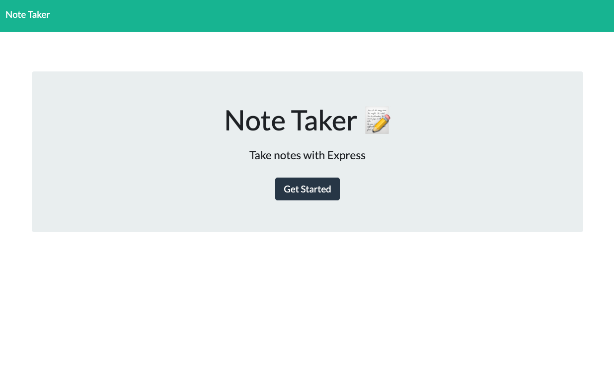

# NoteTaker-Express.js

## Description

This is an application called NoteTaker that can be used to write and save notes. It utilizes Express.js and will save and retrieve note data from a JSON file.

## Table of Contents

- [Installation](#installation)

- [Usage](#usage)

- [Contributing](#contributing)

- [Tests](#tests)

- [License](#license)

- [Questions](#questions)

## Installation

Node.js and Express.js are needed for this project to run.

## Usage

Here is a link to the application on Heroku: https://still-ridge-44940.herokuapp.com/

Here is a screenshot of the application: 

## Contributing

Please feel free to contribute relevant content for future deployments.

## Tests

No Jest testing have been performed at this time.

## License

This project is covered under the GPLv3 license.

## Questions

Please reach out to me with any questions at hutsonwood@gmail.com. You can also check out my other projects at https://github.com/LHWOOD.
